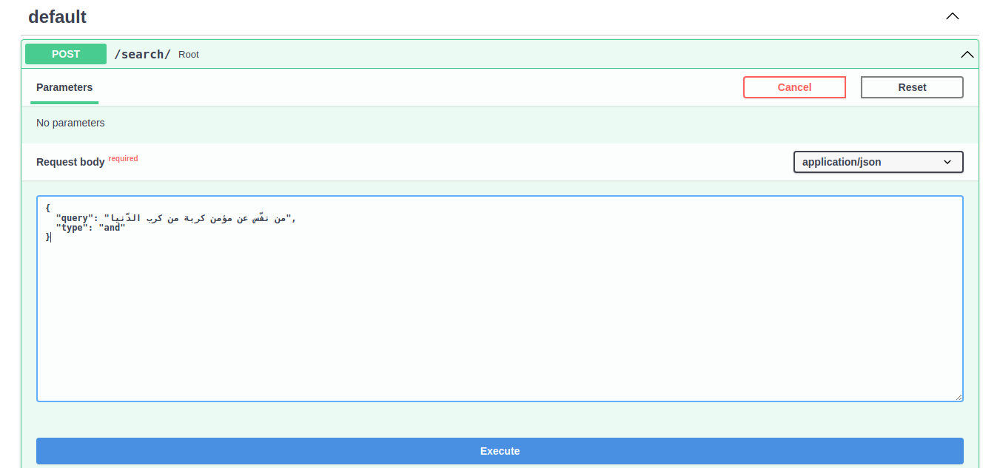
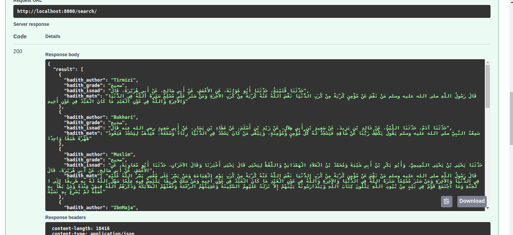

# Hadith search engine

This project is a simple **hadith** search engine for the Prophet Muhammad (ﷺ).

# install

### Download project

```shell
git clone https://github.com/tarek-berkane/hadith-search-engine-whoosh.git
```

result 

```
hadith-search-engine-whoosh
├─ hadith_dir/
├─ raw 
|   ├─ data/ 
|   └─ raw data/
├─ src
|   ├─ __init__.py
|   ├─ analyzer.py
|   ├─ index.py
|   ├─ searcher.py
|   └─ settings.py
├─ __init__.py
├─ api.py
├─ build_csv_files.py
├─ main .py
├─ README.md
├─ LICENCSE
└─ requirements.txt
.
```

### setup envirment

```shell
cd hadith-search-engine-whoosh
python3 -m venv env
source env/bin/activate
pip install -r requirements.txt
```

### Download hadith dataset

[LK-Hadith-Corpus](https://github.com/ShathaTm/LK-Hadith-Corpus)

extract folder and copy inner folders to `raw/raw data`

```
hadith-search-engine-whoosh
├─ ...
├─ raw 
|   ├─ data/ 
|   └─ raw data/
|       ├─  AbuDaud
|       ├─  Tirmizi
|       ├─  Bukhari
|       ├─  Nesai
|       ├─  IbnMaja
|       └─  Muslim
.
```

### Build csv files

```shell
python3 main.py build
```

result

```
hadith-search-engine-whoosh
├─ ...
├─ raw 
|   ├─ data/ 
|       ├─  AbuDaud.csv
|       ├─  Tirmizi.csv
|       ├─  Bukhari.csv
|       ├─  Nesai.csv
|       ├─  IbnMaja.csv
|       └─  Muslim.csv
|   └─ raw data/ 
.       ├─ ...
```

### store data in database
```shell
python3 main.py store
```

### Index csv files

`This will take more than 5 minutes`

```shell
python3 main.py index
```

### Run search engine

```shell
uvicorn api:app --reload
```

# Usage

### to use api open [http://127.0.0.1:8000/docs](http://127.0.0.1:8000/docs)






## Dataset used

LK-Hadith-Corpus [link](https://github.com/ShathaTm/LK-Hadith-Corpus)

## Arabic libraries

- [pyarabic](https://github.com/linuxscout/pyarabic)
- [tashaphyne](https://github.com/linuxscout/tashaphyne)
- [arabicstopwords](https://github.com/linuxscout/arabicstopwords)

## Credit
[Taha Zerrouki](https://github.com/linuxscout)
